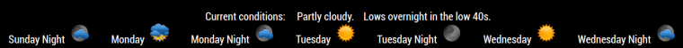

## MMM-BMW

**Bugger My Weather**

## Same church, different pew

I wanted to take a new approach at a weather module. Until now, I had only done WWI and WWI2 but I
wasn't really happy with those, although they were fun to do. This has a bit more style to it (not much)
and it doesn't resemble other modules in format or appearance. I learned a couple of new things while
doing it and I used what I learned in the module itself. Nothing monumental but very satisfying for me.

## Good-bye bottom_bar or lower_thid

* This was designed for use in the bottom_bar or lower_third position of your MagicMirror
* My first real use of icons in a module, denoting the upcoming forecast
* Weather forecast for day and night
* Only the current weather is written out in words

## Examples

## Installation and requirements

* `git clone https://github.com/mykle1/MMM-BMW` into the `~/MagicMirror/modules` directory.

* Free API key at `https://www.wunderground.com`

* No dependencies needed! No kidding!

## Config.js entry and options

    {
		disabled: false,
		module: "MMM-BMW",
		position: "bottom_bar",               // bottom_bar or lower_third is best
		config: {
			apiKey: "YOUR API KEY GOES HERE", // Free API key @ https://www.wunderground.com
			tempUnits: "C",		              // C of F
            	stateOrCountry: 'NY',             // US states abbr. or other country codes
            	city: 'New_York',                 // City, eg. New_York (with underscore - no spaces)
			useHeader: false,                 // true if you want a header                 
			header: "Your header",
			maxWidth: "100%",
		}
	},
	

## Country codes here (If you're not in the US)

https://www.wunderground.com/weather/api/d/docs?d=resources/country-to-iso-matching&MR=1

